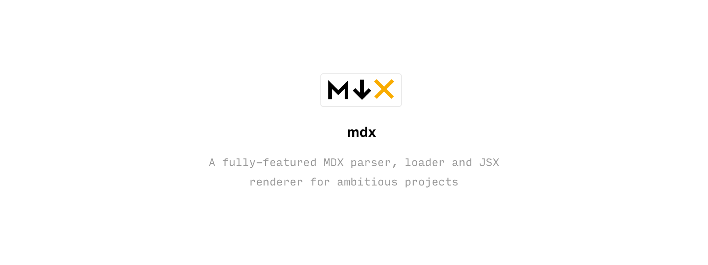

[](https://travis-ci.org/mdx-js/mdx)
[](https://spectrum.chat/mdx)

> Markdown for the component era.

MDX is a format that lets you seamlessly use JSX in your Markdown documents.
You can import components, like interactive charts or notifs, and export metadata.
This makes writing long-form content with components a blast :rocket:.

See it in action

```jsx
import { Chart } from '../components/chart'

# Here's a chart

The chart is rendered inside our MDX document.

<Chart />
```

__:heart: Powerful__: MDX blends Markdown and JSX syntax to fit perfectly in React/JSX-based projects.

__:computer: Everything is a component__: Use existing components inside your MDX and import other MDX files as plain components.

__:wrench: Customizable__: Decide which component is rendered for each Markdown element (`{ h1: MyHeading }`).

__:books: Markdown-based__: The simplicity and elegance of Markdown remains, you interleave JSX only when you want to.

__:fire: Blazingly blazing fast__: MDX has no runtime, all compilation occurs during the build stage.

> [Watch some of these features in action](https://www.youtube.com/watch?v=d2sQiI5NFAM&list=PLV5CVI1eNcJgCrPH_e6d57KRUTiDZgs0u)

> “It's extremely useful for using design system components to render markdown
and weaving interactive components in with existing markdown.”
>
> — [@chrisbiscardi](https://twitter.com/chrisbiscardi/status/1022304288326864896)

## Why?

Before MDX, some of the benefits of writing Markdown were lost when integrating with JSX.
Implementations were often template string-based which required lots of escaping and cumbersome syntax.

MDX seeks to make writing with Markdown _and_ JSX simpler while being more expressive.
The possibilities are endless when you combine components (that can even be dynamic or load data) with the simplicity of Markdown for long-form content.

- Fast
- No runtime compilation
- [Pluggable][remark-plugins]
- Element to React component mapping
- React component `import`/`export`
- Customizable layouts
- Webpack loader
- Parcel plugin
- Next.js plugin
- Gatsby plugin

## Getting started

```
npm init mdx
```

- [Documentation](https://mdxjs.com)
  - [Syntax](https://mdxjs.com/syntax)
  - [Getting Started](https://mdxjs.com/getting-started/)
  - [Plugins](https://mdxjs.com/plugins)
  - [Contributing](https://mdxjs.com/advanced/contributing)

## Related

See related projects in the [MDX specification](https://github.com/mdx-js/specification#related).

## Authors

- John Otander ([@4lpine](https://twitter.com/4lpine)) – [Compositor](https://compositor.io) + [Clearbit](https://clearbit.com)
- Tim Neutkens ([@timneutkens](https://github.com/timneutkens)) – [ZEIT](https://zeit.co)
- Guillermo Rauch ([@rauchg](https://twitter.com/rauchg)) – [ZEIT](https://zeit.co)
- Brent Jackson ([@jxnblk](https://twitter.com/jxnblk)) – [Compositor](https://compositor.io)

---

> [MIT](./license) license

[remark-plugins]: https://github.com/remarkjs/remark/blob/master/doc/plugins.md
